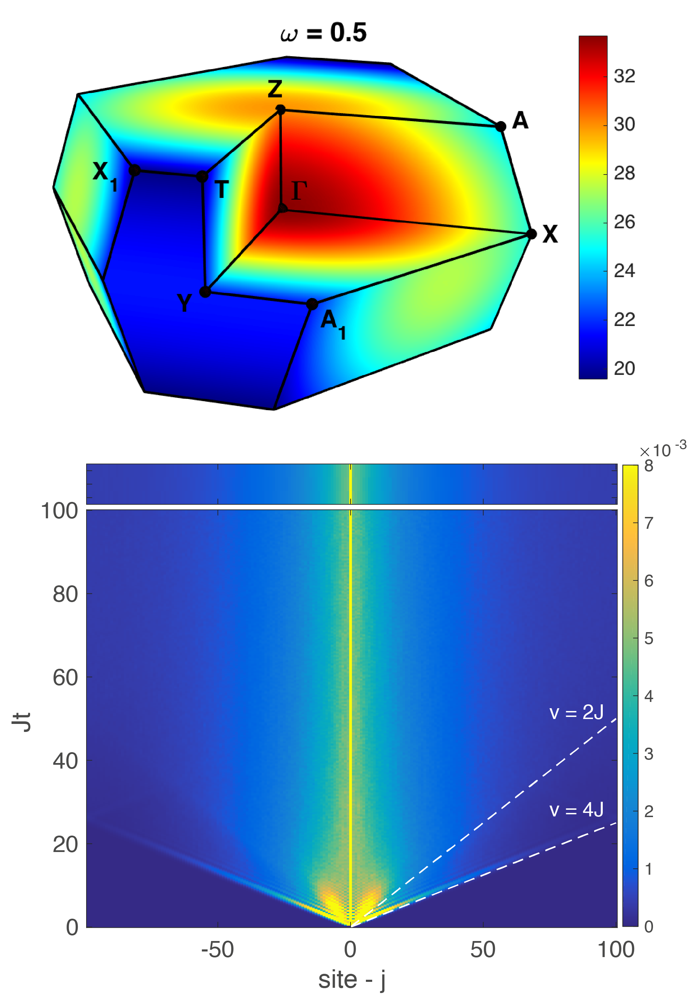

 I am a condensed matter theorist interested in the dynamics of quantum systems away from equilibrium.  

Recently, I studied the dynamics of 3D Kitaev quantum spin-liquids (QSLs). We calculated the dynamical structure factor for a range of lattices with low-energy density of states spanning those possible in 3D. The dynamical structure factor is measurable in inelastic neutron scattering (INS) experiments and our results reveal the different possible signatures in 3D and suggest INS as the spectroscopy of choice to illuminate the physics of Majorana fermions in Kitaev QSLs.  

My current work concerns a simple model of localization without quenched disorder, either in the Hamiltonian parameters or the initial state. Disorder is generally thought to be necessary for localization – both Anderson (single particle) and many-body varieties – but we have demonstrated that this isn’t the case. Our work raises general questions about relaxation in isolated quantum systems through connections to Many-Body Localization and a recently suggested Quantum Disentangled Liquid – two alternate paradigms to eigenstate thermalization beyond integrable systems. Future directions of this work include higher dimension generalizations and the connection to lattice gauge theories. 

